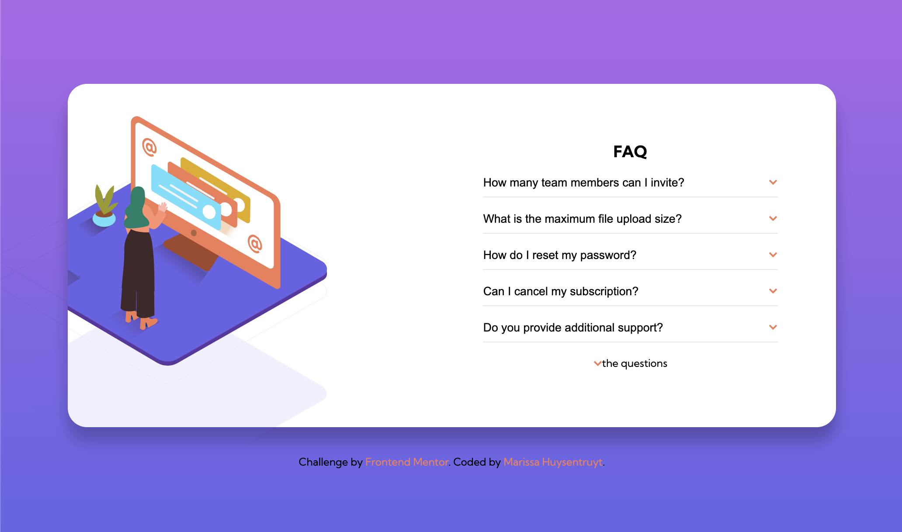

# Frontend Mentor - FAQ accordion card solution

This is a solution to the [FAQ accordion card challenge on Frontend Mentor](https://www.frontendmentor.io/challenges/faq-accordion-card-XlyjD0Oam). Frontend Mentor challenges help you improve your coding skills by building realistic projects. 


## Table of contents

- [Welcome & Overview](#welcome-👋)
  - [The challenge](#the-challenge)
  - [Where to find everything](#where-to-find-everything)
  - [Running the project](#running-the-project)
  - [Deploying the project](#deploying-the-project)
  - [Screenshot](#screenshot)
  - [Links](#links)
- [My process](#my-process)
  - [Built with](#built-with)
  - [What I learned](#what-i-learned)
  - [Continued development](#continued-development)
  - [Useful resources](#useful-resources)
- [Author](#author)

**To do this challenge, you need a basic understanding of HTML, CSS and JavaScript.**

## Welcome 👋
This coding challenge is to build an accordion, which is one of those web components that is just notorious to build accessibly. On my second attempt at building this, I used a site that I helped create, called the [Accessible Components Cheatsheet](https://accessible-components.sparkbox.com/), to rebuild this accordion with a bigger focus on accessibility. The final product should be more keyboard accessible, more screen reader accurate, and built more semantically.

### The challenge

Build out this FAQ accordion card and get it looking as close to the design as possible.

Users should be able to:

- View the optimal layout for the component depending on their device's screen size
- See hover states for all interactive elements on the page
- Hide/Show the answer to a question when the question is clicked

### Where to find everything

If you would like to see the static design files, you may find them in the /design folder. You'll see both a mobile and a desktop version.

There is also a style-guide.md file containing the information regarding the designs, such as color palette and fonts.

### Running the project

There's not active development server for this project, so you'll have to pull the index.html file into your browser, make changes and refresh the browser in order to see your changes.

### Deploying the project

There are many ways to host your project for free. Recommended hosts are:

- [GitHub Pages](https://pages.github.com/)
- [Vercel](https://vercel.com/)
- [Netlify](https://www.netlify.com/)

You can see this deployed version via GitHub Pages [here](https://marissahuysentruyt.github.io/FAQ-Accordion-card/).

### Screenshot


### Links

- Most recent Solution: [More accessible solution](https://www.frontendmentor.io/solutions/accessibility-wcag-hzWOHm6vWJ)
- First Solution URL: [Quite possibly inaccessible solution](https://www.frontendmentor.io/solutions/faq-accordian-html-css-js-atYOFpzPa)
- Live Site URL: [Live Site](https://marissahuysentruyt.github.io/FAQ-Accordion-card/)

## My process
This most recent version of the FAQ accordion was just a simple refactor. When I originally built this project, I focused on the HTML & CSS first, with some bug-laden JavaScript. This time around, after refactoring the HTML to be more semantic for an accordion, I used JavaScript that would enforce accessibility, like turning on and off specific ARIA attributes in order to get the functionality I want.

### Built with

- Semantic HTML5 markup
- Flexbox
- Accessibility ([WCAG](https://www.w3.org/TR/WCAG22/))

### What I learned

Building this accordion accessibly was different than when I just looking for the functionality. The code below is the click event that fires when a user tries to open and expand the accordion section (the panel). Basically, the new variable `panelWasClosed` is attached to each accordion panel, specifically when the panel is closed (mean `aria-expaned === false`). The click function collapses all of the panels, then changes the target panel's `aria-expanded` value to `true`, removes the parent's `collapsed` class, and the content gets revealed.

````
const handleAccordionClick = (e) => {
    const panelWasClosed = e.target.getAttribute("aria-expanded") === "false";

    collapseAll();

    if(panelWasClosed) {
        e.target.setAttribute("aria-expanded", true);
        e.target.parentElement.classList.remove("collapsed");
    }
};
````

### Continued development

I had some issues with using inline SVGs with this project. The responsiveness caused some content shifting, which isn't ideal, and I couldn't quite figure out how to layer the SVGs properly to match the design.

### Useful resources

[Accessible Components Cheatsheet](https://accessible-components.sparkbox.com/)

This site was built by the [Sparkbox Apprentices](https://apprentices.sparkbox.com/) of the summer of 2022, which I was a part of. The site continues to live on with [Sparkbox](https://sparkbox.com/)'s accessibility guild, and we have big plans to expand our cheatsheets, giving quick, usable code snippets to developers who want to create accessible web components. I used the accordion example for this specific project, to make sure things were keyboard accessible, was read by a screen reader well, and even tried to use a `details` and `summary` semantic element for less JavaScript (my Sparkbox accessibility experts decided that the `details` & `summary` elements are not discoverable enough, and it's better from an accessibility standpoint to create the custom accordion).


## Author

- Website - [Marissa Huysentruyt](https://www.marissahuysentruyt.com)
- Frontend Mentor - [@marissahuysentruyt](https://www.frontendmentor.io/profile/marissahuysentruyt)

**Have fun building!** 🚀